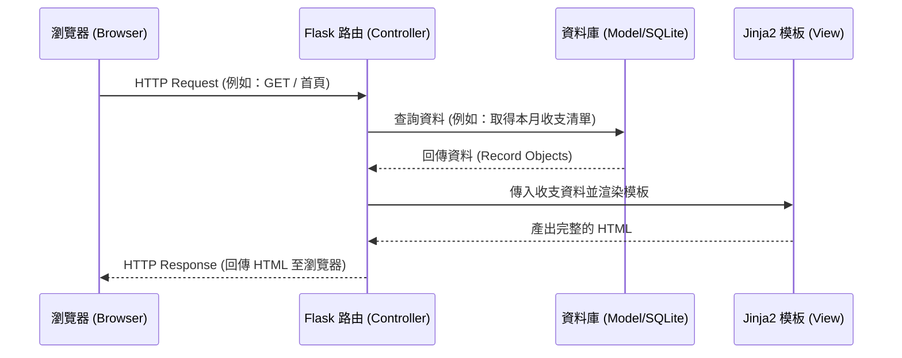

# 系統架構設計 (ARCHITECTURE)

基於個人記帳簿 (Personal Expense Tracker) 的 PRD 需求，以下為系統的架構設計文件，說明了技術選型、資料夾結構以及各元件間的協作方式。

## 1. 技術架構說明

本專案採用輕量級的 Python 網頁框架 Flask 來進行開發，並搭配傳統的「伺服器端渲染 (SSR)」架構，不採用前後端分離，以求快速且直覺的開發流程。

### 選用技術與原因
- **後端 (Python + Flask)**：Flask 是一個微型且靈活的框架，非常適合打造像記帳簿這類功能單純的工具應用程式，避免不必要的複雜設定。
- **模板引擎 (Jinja2)**：直接整合在 Flask 中，能將後端的資料透過 HTML 標籤直接渲染到前端頁面上，無須額外撰寫複雜的前端 API 請求邏輯。
- **資料庫 (SQLite)**：記帳系統初期主要用於個人或少數使用者，SQLite 無需安裝獨立伺服器且為單一檔案形式，極度適合 MVP 階段快速測試與部署。

### Flask MVC 模式說明
雖然 Flask 本身沒有強制的目錄規範，但我們將依循 MVC（Model-View-Controller）的設計理念：
- **Model（模型）**：負責定義資料結構與操作資料庫（如存取收支紀錄、分類等），並透過 ORM（如 Flask-SQLAlchemy）與 SQLite 溝通。
- **View（視圖）**：由 `templates/` 資料夾下的 Jinja2 HTML 檔案組成，負責將 Controller 傳來的資料呈現為使用者可見的網頁。
- **Controller（控制器）**：對應到 Flask 的路由（Routes），負責接收使用者的網頁請求、向 Model 取資料，並決定要渲染哪個 View 傳回給使用者。

---

## 2. 專案資料夾結構

專案將採取清晰的模組化結構，將邏輯、模板、靜態檔案分離。

```text
web_app_development2/
├── app/                     ← 核心應用程式模組
│   ├── __init__.py          ← 負責初始化 Flask 應用程式與資料庫設定
│   ├── models.py            ← 資料庫模型 (Model：定義 Record 紀錄、Category 分類等)
│   ├── routes.py            ← Flask 路由 (Controller：處理所有 URL 請求與業務邏輯)
│   ├── templates/           ← HTML 模板 (View：Jinja2 負責渲染頁面)
│   │   ├── base.html        ← 共用版型 (包含導覽列、頁尾、引入 CSS)
│   │   ├── index.html       ← 首頁 (顯示收支列表與當月統計)
│   │   └── form.html        ← 新增/編輯收支紀錄的表單頁面
│   └── static/              ← 靜態資源檔案
│       ├── style.css        ← 全站共用樣式表
│       └── app.js           ← 前端互動邏輯 (可選，例如表單驗證或圖表繪製)
├── instance/
│   └── database.db          ← SQLite 資料庫實體檔案 (通常不進版控)
├── docs/                    ← 專案文件存放區 (包含 PRD.md, ARCHITECTURE.md 等)
├── requirements.txt         ← 記錄專案相依的 Python 套件
└── run.py                   ← 專案的啟動入口程式
```

---

## 3. 元件關係圖

以下展示了當使用者造訪網站時，系統各元件的互動流程：



---

## 4. 關鍵設計決策

1. **單體式架構 (Monolith) 與伺服器端渲染 (SSR)**
   - **決策**：前端採用原生 HTML/CSS 搭配 Jinja2 伺服器端渲染，不使用 React/Vue 等前端框架建立 SPA（單頁應用程式）。
   - **原因**：由於 MVP 階段重在快速驗證核心的「記帳與檢視」功能，SSR 能省去建置及維護 API 的成本，帶來更單純且易於修改的架構。

2. **採用 SQLite 作為資料庫**
   - **決策**：不架設 MySQL 或 PostgreSQL 伺服器，選擇輕便的 SQLite 檔案型資料庫。
   - **原因**：個人記帳系統資料結構單純，且前期為單機或少數用戶情境，SQLite 不需額外安裝設定，可將心力完全專注於功能開發。

3. **集中化的路由設計 (無 Blueprint)**
   - **決策**：初期的所有路由（收支列表、新增、編輯、刪除）將集中寫在 `app/routes.py` 檔案內。
   - **原因**：目前頁面與功能數量尚不多，集中管理有利於快速除錯與檢視；若未來功能大幅擴充（例如加入圖表中心、使用者帳號系統），再考慮引入 Flask Blueprint 進行路由拆分。
