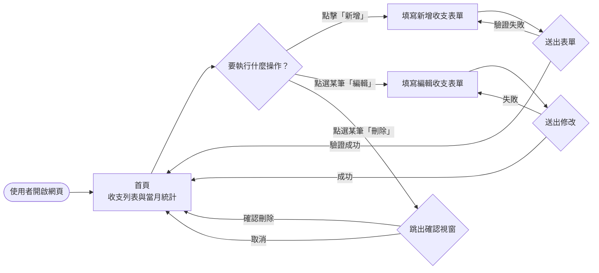
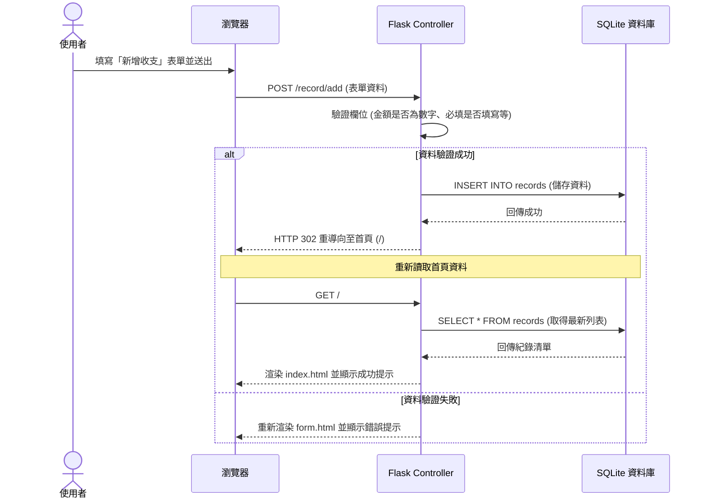

# 流程圖設計 (FLOWCHART)

這份文件基於 PRD 與 ARCHITECTURE 的規劃，視覺化了個人記帳簿系統的「使用者操作路徑」與「資料處理流程」，確保在實作前釐清所有的步驟與邏輯。

## 1. 使用者流程圖 (User Flow)

這張圖描述了使用者進入網站後，可以進行的各種操作路徑：

## 2. 系統序列圖 (Sequence Diagram)

以下以最核心的「新增一筆收支」為例，展示前端瀏覽器、後端 Flask 控制器以及 SQLite 資料庫之間的互動流程：

## 3. 功能清單對照表

這是後續實作 API 與路由 (Routes) 時的重要參考表：

| 功能名稱 | 描述 | URL 路由路徑 | HTTP 方法 |
| --- | --- | --- | --- |
| 檢視首頁 | 顯示全部收支列表與當月的總計資訊 | `/` | `GET` |
| 顯示新增表單 | 呈現新增收支的空白填寫頁面 | `/record/add` | `GET` |
| 處理新增資料 | 接收表單提交，驗證並寫入資料庫 | `/record/add` | `POST` |
| 顯示編輯表單 | 帶入舊有資料，呈現編輯頁面 | `/record/edit/<int:id>` | `GET` |
| 處理編輯資料 | 接收表單提交，驗證並更新該筆紀錄 | `/record/edit/<int:id>` | `POST` |
| 處理刪除要求 | 將指定的收支紀錄從資料庫中移除 | `/record/delete/<int:id>` | `POST` |
